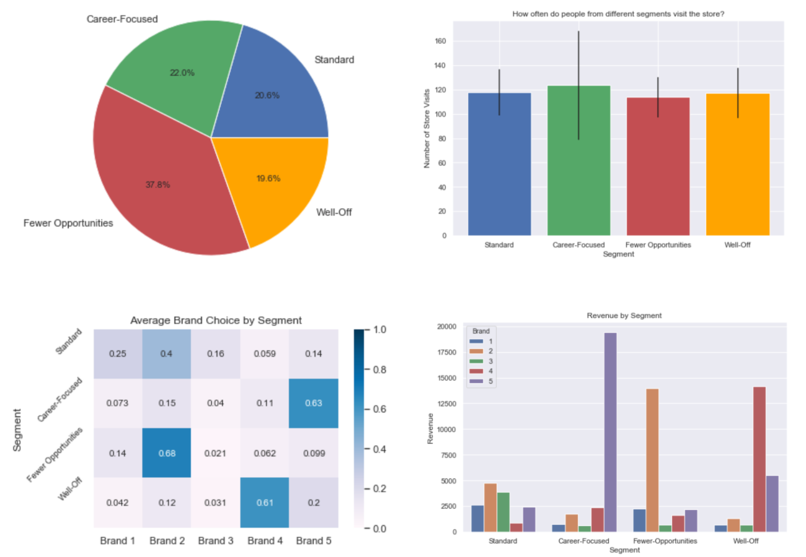

# Purchase Analytics
Brand Choice, Revenue and Descriptive Statistics by Customer Segments

## Installation
- Python 3.7.3
- Libraries: pandas, NumPy, Matplotlib, Seaborn, scikit-learn

## File Descriptions
Dataset and its legend can be found in [`data`](https://github.com/k-bosko/purchase_analytics/tree/master/data) folder.

[`pickle`](https://github.com/k-bosko/purchase_analytics/tree/master/pickle) folder contains the results of customer segmentation (StandardScaler, PCA, KMeans).

The analysis can be found as Jupyter Notebook here:

* [purchase_analytics.ipynb](https://github.com/k-bosko/purchase_analytics/blob/master/Purchase_Analytics.ipynb)

## Project Description
In this project, I analyzed purchase behavior of 500 customers that bought 5 different brands of chocolate candy bars in a physical FMCG store during 2 years. In total, they made 58,693 transactions, captured through the loyalty cards they used at checkout. 

Based on the results of customer segmentation, I explored the segments sizes and answered the following business questions:

- How often do people from different segments visit the store?
- What brand do customer segments prefer on average?
- How much revenue each customer segment brings?

## Results

There are 4 different customer segments:
- Fewer-Opportunities (38%)
- Career-Focused (22%)
- Standard (20%)
- Well-Off (20%).

Customer segments don't differ much in shopping frequency - with about 120 store visits on average during 2 years. The least homogenous group in this respect is Career-Opportunities segment with customers visiting the store as least as about 80 times as much as about 160 times. 

Fewer-Opportunities is the biggest customer segment (38%). However, it brings less money in terms of revenue because customers from this group prefer brands that are inexpensive (almost 70% buys Brand 2).

We should focus our marketing efforts more on Career-Opportunities segment (22%) which brings the most revenue and seems to be loyal to the most expensive brand (63% prefer Brand 5). This group also buys chocolate candy bars most frequently among all segments. Hence, it is a good idea to calculate price elasticity to see if we can increase prices for this segment even further without loosing customers.

## Acknowledgement
This project is part of "Customer Analytics" course by [365DataScience](https://365datascience.com)

However, I modified and streamlined some code (e.g. through using matrix multiplication when calculating Revenue or by using agg function when aggregating multiple columns).
